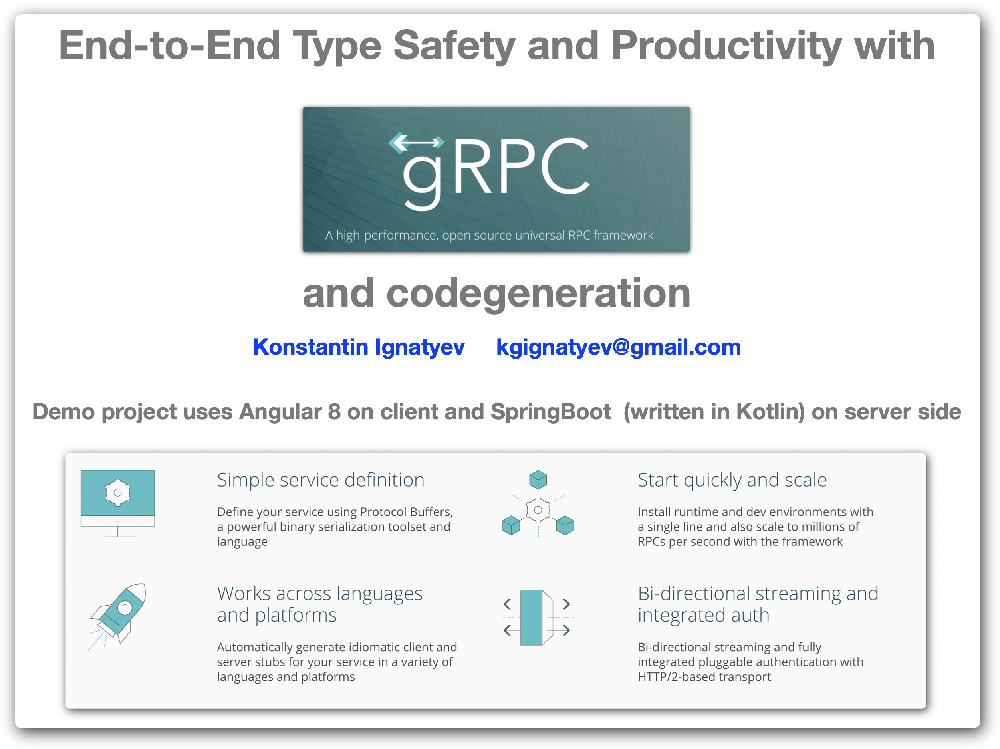

[slides](docs/overview.pdf)

Prerequisite
---

have access to a npm repo to deploy artifacts, for example by running Nexus

Generate Client and Server sides from Interface Definition
---

Well Defined Contract between server and client.
It is quite tolerant of changes as long as rules of evolution are followed  
https://blog.envoyproxy.io/evolving-a-protocol-buffer-canonical-api-e1b2c2ca0dec

Note: every change should update version number, no snapshots!

    cd interface
    ./build-stubs.sh
    
that generates server side implementation stubs and client, plus versioned 
documentation in html and markdown formats. HTML documentation is publisheable
and markdown is convenient for embedding into npm module 
  
Run Postgres DB
---
Easy to run in K8s (for example local docker or other mini k8s)

    cd k8s
    ./render-postgres-chart.sh
    kubectl apply -f target/pg-k8s-descriptor.yaml

that gives us Postgres running in k8s and exposed on port 30303, then lets
create a database there and call it 'geography' ( or any other name but more adjustments
will be necessary) 

Create Database and DB schema
---

     cd geography-service
     ./create-db.sh  
     ./run-db-migration.sh 

Lets (re)-Generate DAO layer
---

     cd geography-service
     ./run-dao-gen.sh
   

  
Run Service
---

    cd geography-service    
    source set-db-env.sh    
    mvn  spring-boot:run
    
Run Proxy
---
compile or download Envoy or grpcwebproxy binaries for your machine
https://www.envoyproxy.io/
or 
https://github.com/improbable-eng/grpc-web/tree/master/go/grpcwebproxy

then run ./run-grpcweb-proxy.sh or  ./run-envoy-proxy.sh in proxy subdirectory

    cd proxy
    ./run-envoy-proxy.sh

Run Client
---
it is a standard Angular 8 application

    cd geography-client
    npm install
    ng s
    
now we can access application at http://localhost:4200    
    
